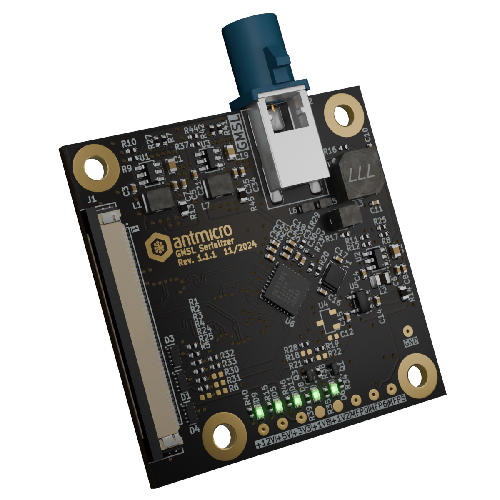

# GMSL Serializer Board

Copyright (c) 2023-2024 [Antmicro](https://www.antmicro.com)

## Overview

This project contains open hardware design files for the GMSL Serializer Board.
This board accepts MIPI CSI-2 signals from Antmicro's 50-pin FFC video interface and transmits the video data over GMSL2.
The GMSL Serializer Board is powered over GMSL coaxial cable.

The design files were prepared in KiCad 7.

## Key features

* Input: 4-lane MIPI CSI-2 interface on a 50-pin Antmicro Dual Camera connector
* Output: GMSL2 interface exposed on a FAKRA connector
* PoC filter for sinking power from the GMSL coaxial cable

## Project structure

The main project directory contains KiCad PCB project files, a LICENSE, and a README.
The remaining files are stored in the following directories:

* `img` - contains board visualization for this README
* `doc` - contains schematics
* `assets` - contains visual assets for showcasing the board on Antmicro [Open Hardware Portal](https://openhardware.antmicro.com)

## Licensing

This project is published under the [Apache-2.0](LICENSE) license.
